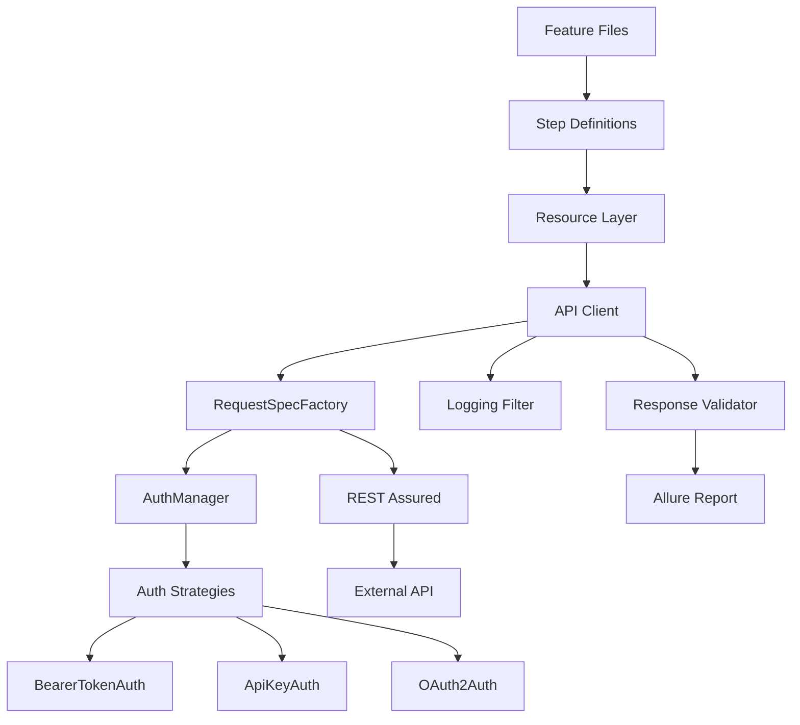

# 🚀 Enterprise API Automation Framework

A scalable **Enterprise API Test Automation Framework** built using **Java, Maven, Cucumber, JUnit5, REST Assured, and Allure**.

This project demonstrates **real-world industry architecture** used for building reliable, maintainable, and parallel-ready API automation frameworks.

The framework focuses on:

* Clean architecture
* Parallel test execution
* Reusable API client design
* Authentication strategy pattern
* Centralized request configuration
* Rich reporting
* CI/CD ready execution

---

# 🔥 Professional Project Description (for GitHub)

**Enterprise API Automation Framework** is a production-ready test automation framework designed for modern API-based systems.

Built using **Java + Cucumber BDD + REST Assured**, the framework provides a scalable architecture that supports **parallel execution, dynamic authentication strategies, centralized request specifications, and detailed reporting with Allure**.

It follows **industry best practices used in large-scale engineering teams**, including:

* Strategy pattern for authentication
* Thread-safe parallel execution
* Layered architecture (Client → Resource → Test)
* Centralized configuration management
* Detailed request/response logging
* CI/CD friendly design

This framework can be easily extended for **microservices testing, contract validation, and high-scale automation suites**.

---

# 🧰 Technology Stack

| Technology      | Purpose                         |
| --------------- | ------------------------------- |
| Java            | Core programming language       |
| Maven           | Build and dependency management |
| Cucumber        | BDD test framework              |
| JUnit 5         | Test execution platform         |
| REST Assured    | API testing library             |
| Allure          | Test reporting                  |
| SLF4J + Logback | Logging                         |

---

# 📦 Key Framework Features

## 1️⃣ Behavior Driven Development (BDD)

Tests are written in **Cucumber feature files** using natural language.

Example:

```gherkin
Feature: User API

Scenario: Create user
  When I create a random user
  Then the response status should be 201
  And the response body should not be empty
```

Benefits:

* Readable by non-technical stakeholders
* Clear test documentation
* Easy collaboration between QA and developers

---

# ⚡ Parallel Execution

The framework supports **parallel execution using JUnit Platform**.

Each scenario runs in an **isolated thread** using:

* ThreadLocal RequestSpecification
* Scenario-scoped context
* Stateless API clients

Example thread logs:

```
ForkJoinPool-2-worker-1
ForkJoinPool-2-worker-2
ForkJoinPool-2-worker-3
```

Benefits:

✔ Faster execution
✔ Scalable test suite
✔ CI/CD ready

---

# 🔐 Authentication Framework

The framework supports multiple authentication types using the **Strategy Pattern**.

Supported authentication:

| Auth Type    | Supported |
| ------------ | --------- |
| Bearer Token | ✅         |
| OAuth2       | ✅         |
| JWT          | ✅         |
| API Key      | ✅         |

Example configuration:

```properties
auth.type=bearer
auth.token=your_token_here
```

Authentication is automatically applied via:

```
AuthManager → AuthStrategy → RequestSpecification
```

Strategies implemented:

```
BearerTokenAuth
ApiKeyAuth
OAuth2Auth
```

---

# 🧱 Framework Architecture

The framework follows a **layered architecture**.

```
Tests
  ↓
Step Definitions
  ↓
Resource Layer
  ↓
API Client Layer
  ↓
Request Specification Factory
  ↓
Authentication Manager
  ↓
REST Assured
```

---

# 📊 Architecture Diagram



---

# 📁 Project Structure

```
src
 ├── main
 │   └── java
 │       └── com.company.automation
 │
 │       core
 │       ├── auth
 │       │     AuthManager
 │       │     BearerTokenAuth
 │       │     ApiKeyAuth
 │       │     OAuth2Auth
 │       │
 │       ├── client
 │       │     BaseApiClient
 │       │
 │       ├── config
 │       │     ConfigReader
 │       │
 │       ├── context
 │       │     ScenarioContext
 │       │
 │       ├── logging
 │       │     ApiLoggingFilter
 │       │
 │       ├── spec
 │       │     RequestSpecFactory
 │       │
 │       └── validation
 │             ResponseValidator
 │
 ├── test
 │   ├── runners
 │   │     ApiTestRunner
 │   │
 │   ├── stepdefinitions
 │   │     UserSteps
 │   │
 │   └── features
 │         user
 │         create_user.feature
```

---

# 📡 API Logging

The framework logs detailed API execution information.

Captured data:

* HTTP Method
* Endpoint
* Request Headers
* Request Body
* Response Body
* Status Code
* Response Time

Example log:

```
POST https://jsonplaceholder.typicode.com/users

Request Body:
{
 "name": "John",
 "email": "john@test.com"
}

Status: 201
Time: 501 ms
```

---

# 📊 Allure Reporting

Test execution reports are generated using **Allure**.

Reports include:

* Step execution
* Request/Response attachments
* Execution timeline
* Pass/Fail details
* Logs

Generate report:

```bash
allure serve target/allure-results
```

---

# 🧪 Response Validation

Reusable validation utilities ensure reliable test assertions.

Example validations:

```
Status code validation
Response body validation
JSON schema validation
```

Example usage:

```java
ResponseValidator.validateStatus(response, 201);
ResponseValidator.validateBodyNotEmpty(response);
```

---

# ⚙️ Configuration Management

Configuration is managed via:

```
config/config.properties
```

Example:

```properties
env=qa
base.url=https://jsonplaceholder.typicode.com

auth.type=bearer
auth.token=your_token_here
```

Benefits:

✔ Easy environment switching
✔ Secure token injection
✔ CI/CD compatibility

---

# 🚀 Running Tests

Run all tests:

```bash
mvn clean test
```

Run smoke tests:

```bash
mvn test -Dcucumber.filter.tags=@SmokeTestResource
```

Run with environment override:

```bash
mvn test -Denv=qa
```

Run with token from CI:

```bash
mvn test -Dauth.token=${API_TOKEN}
```

---

# 🔄 CI/CD Integration

The framework is designed for seamless CI/CD execution.

Supported pipelines:

* Jenkins
* GitHub Actions
* GitLab CI

Example pipeline step:

```bash
mvn clean test
```

Allure reports can be published automatically after test execution.

---

# 📈 Example Execution Result

```
Tests run: 9
Failures: 0
Errors: 0
Time: 12 seconds
```

Parallel execution significantly reduces runtime.

---

# 🔮 Future Enhancements

Planned improvements:

* Automatic OAuth token generation
* Token refresh mechanism
* Test data factory layer
* Contract testing support
* API mocking
* Performance monitoring

---

# 👨‍💻 Author

Automation Engineer with **10+ years of experience in software testing and automation**, specializing in:

* Selenium automation frameworks
* API automation
* CI/CD pipeline integration
* Test architecture design

---

# ⭐ Contributing

Contributions are welcome.

1. Fork the repository
2. Create a feature branch
3. Submit a pull request

---

# 📜 License

This project is open-source and available for learning and professional development.
